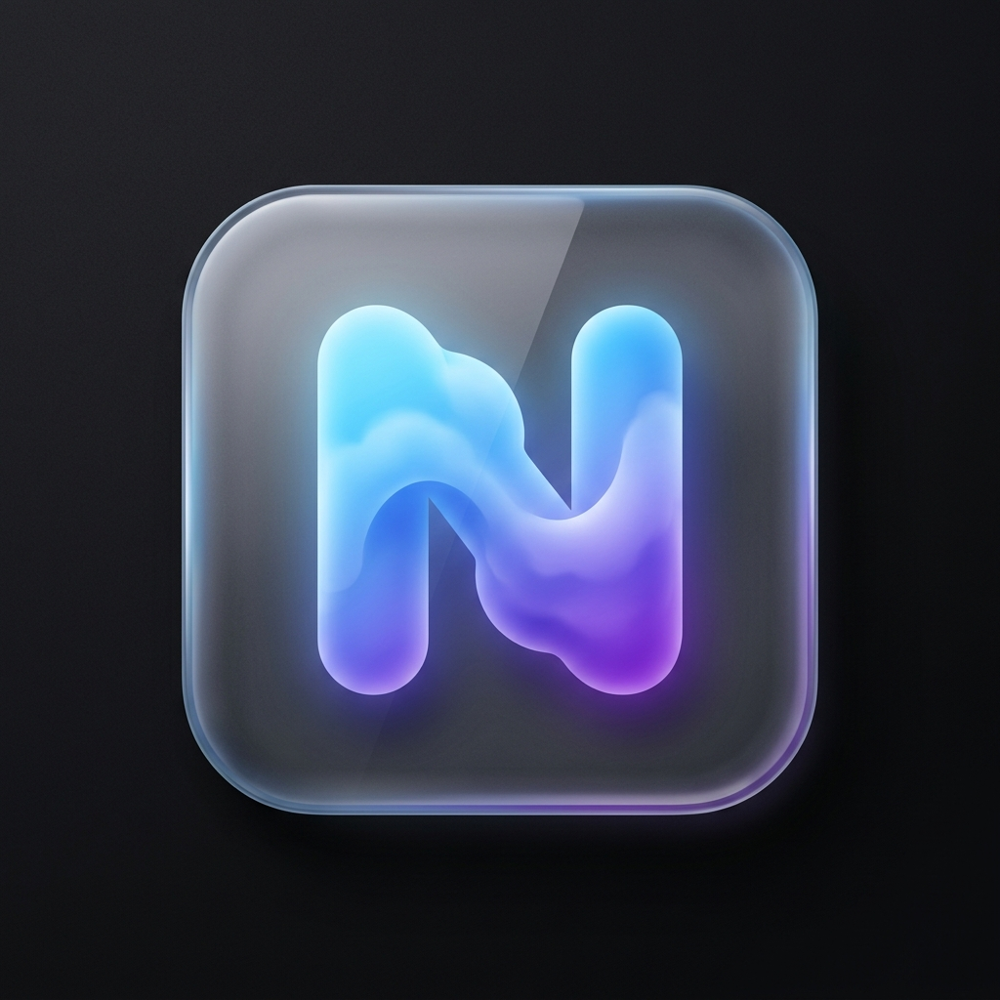

# NextFolders 📁☁️

**NextFolders** — это легковесное и портативное десктопное приложение для автоматизированного создания шаблонов структур папок в Nextcloud по протоколу WebDAV. Идеально подходит для менеджеров проектов, дизайнеров и команд, которым нужно быстро разворачивать стандартизированные директории под новые задачи.

 <!-- Пример отображения иконки -->

## 🚀 Особенности

- **Zero-Dependency Экзешник:** Программа является переносимой и поставляется в виде одного `.exe` файла. Не требует прав администратора и установки сторонних библиотек.
- **Интерактивное древо сервера:** Утилита лениво подгружает папки с вашего сервера "на лету", позволяя выбрать место для нового проекта без ручного ввода путей.
- **Безопасность:** Пароли не хранятся в открытом виде. Используется нативный менеджер паролей операционной системы (Windows Credential Manager / macOS Keychain).
- **Неограниченная вложенность:** Программа сама рассчитывает и создает все промежуточные папки.
- **Настройка через YAML:** Все шаблоны вынесены в удобный и редактируемый файл `config.yaml`.

---

## 🛠 Настройка шаблонов (Инструкция по `config.yaml`)

Файл `config.yaml` автоматически создается в той же папке, где находится `.exe` файл, при первом запуске приложения. 

### Структура файла
Файл имеет простую структуру: блок с настройками по умолчанию `settings` и блок шаблонов `templates`.

```yaml
settings:
  server_url: https://your-cloud.domain.com
  username: admin_user
templates:
  Название Шаблона 1:
    - Папка/Подпапка
    - Другая папка
  Название Шаблона 2:
    - Вложенность/Уровень 2/Уровень 3/Уровень 4
```

### Как писать шаблоны

1. **Создайте ключ шаблона**: Придумайте имя шаблона, например `Разработка ПО:`. Не забудьте двоеточие на конце.
2. **Добавьте список (через тире `-`)**: Каждый элемент списка — это путь к папке.
3. **Используйте слэш (`/`) для вложенности**: Чтобы создать папку внутри другой папки, разделите их слэшем. Например: `- Фотографии/Оригиналы/2026`. 

Приложение достаточно умное, чтобы не создавать родительскую папку дважды, так что вы можете смело перечислять пересекающиеся пути:

```yaml
templates:
  Медиа Проект:
    # Приложение автоматически создаст папку "Видео", затем "Видео/Исходники" и т.д.
    - Видео/Исходники
    - Видео/Рендер
    - Видео/Монтаж/Proxy
    - Аудио/Музыка
    - Аудио/Голос
    - Документы
```

### Привязка к интерфейсу
Каждый добавленный вами корневой ключ в блоке `templates` (например, "Медиа Проект") сразу же появится в выпадающем меню приложения в интерфейсе "Шаблон структуры". Чтобы обновить список во время работы программы, нажмите кнопку **"↻ Обновить конфиг"**.

---

## 🔑 Учетные данные (Важно)

Вместо использования основного пароля от вашей учетной записи, настоятельно рекомендуется создать **App Password (Пароль приложения)**:
1. Зайдите в веб-интерфейс вашего Nextcloud.
2. Перейдите в `Настройки -> Безопасность -> Устройства и сеансы`.
3. Создайте новый пароль приложения с именем "NextFolders".
4. Используйте сгенерированный пароль в программе. Это позволит вам легко отозвать доступ приложению в будущем без смены вашего главного системного пароля.

---
*Собрано с любовью при помощи Wails, Go и React.*
